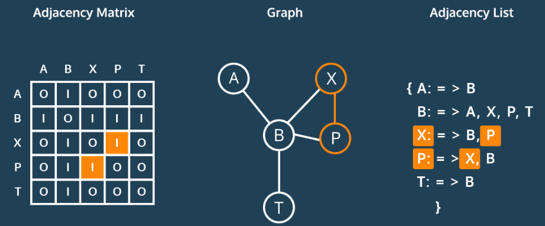

# CSEU2 Graphs GP

## What is a graph and how is it represented?

*Terminology:*

- Directed vs. Undirected
- Twitter follow (directed) vs. Facebook friendship (undirected)
- Undirected edge is the same as bi-directional edge
- Cyclic vs. Acyclic
- Dense vs. Sparse
    - Subway map (sparse)
    - Flight map (dense)
- Weighted vs. Unweighted
    - Heavy traffic vs. light traffic

## Adjacency List & Adjacency Matrix
The two most common ways to represent graphs in code are *adjacency lists* and *adjacency matrices*, each with its own strengths and weaknesses. When deciding on a graph implementation, it's important to understand the type of data and operations you will be using.



### Implement a Graph

#### Using an Adjacency Matrix 

One way of representing connections between verts is with a matrix that
records `1` for a connection or `0` for no connection.

```
    A B C D
  +--------
A | 0 0 1 1
B | 0 0 1 0
C | 1 0 0 1
D | 1 0 1 0
```

In the above example B connects to C, but C does not connect back to B.

#### Using an Adjacency List

Another way is to store a list of verts that a particular vert connects
to.

```
A -> [ C D ]
B -> [ C ]
C -> [ A D ]
D -> [ A C ]
```

This is the recommended approach for our graph projects.

## BFT

### Synopsis
We can use BFT to traverse a graph, starting at levels closest to the root and finishing at those furthest away.
- Good to use when solving *Shortest Path* problems and other scenarios where you know that the *solution is not far from the root*

### Algorithm
1. Begin at the starting Vertex (s)
2. Explore Vertex
    a. while +1 unscheduled vertices adjacent to current vertex
        i. Schedule adjacent vertex to be explored in a *queue*
3. Mark vertex as explored ( Remove from queue )

## DFT

### Synopsis
Algorithm used to search a graph. Explores all possible paths to find one with the smallest weight, *traversing down a branch before traversing accross nodes at the same level as the root node*. It never revisits nodes.

We can use DFT to *search each branch to it's deepest level* before exploring another branch.

Good to use when solving a problem where you know the *solution is very far from the root*

### Algorithm
1. Begin at the starting Vertex (s)
2. Explore Vertex using a *stack*
    a. If unexplored, adjacent vertex
        i. explore adjacent vertex
    b. Mark explored once all adjacent vertices have been explored ( remove from a stack )

## Graph traversal

```
    q = []
    visited = {}

    # enqueue starting vertex ID
    q = [1]
    visited = {}

    # Dequeue first vertex
    q = []
    visited = {}

    1

    # check if it has been visited ( no )
    q = []
    visited = {}

    1

    # mark as visited and enqueue it's neighbors
    q = [2]
    visited = {1}

    # Dequeue first vertex
    q = []
    visited = {1}

    2

    # check if it has been visited ( no )
    q = []
    visited = {1}

    2

    # mark as visited and enqueue it's neighbors
    q = [3, 4]
    visited = {1, 2}

    # Dequeue first vertex
    q = [4]
    visited = {1, 2}

    3

    # check if it has been visited ( no )
    q = [4]
    visited = {1, 2}

    3

    # mark as visited and enqueue it's neighbors
    q = [4, 5]
    visited = {1, 2, 3}

    # we will be skipping 4, 6 and 7 and moving to 5

    
    # Dequeue first vertex
    q = []
    visited = {1, 2, 3, 4}

    5

    # check if it has been visited ( no )
    q = []
    visited = {1, 2, 3, 4}

    5

    # mark as visited and enqueue it's neighbors
    q = [3]
    visited = {1, 2, 3, 4, 5}

    # Dequeue first vertex
    q = []
    visited = {1, 2, 3, 4, 5}

    3

    # check if it has been visited ( yes )
    q = []
    visited = {1, 2, 3, 4, 5}

```